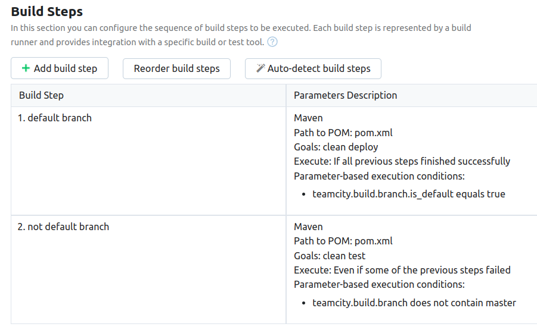
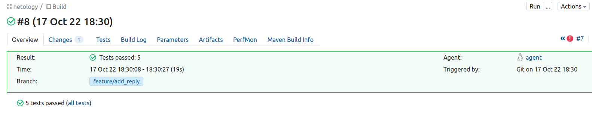
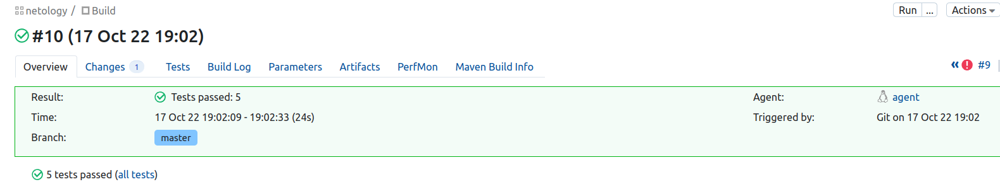

# Домашнее задание к занятию "09.05 Teamcity"

## Подготовка к выполнению

1. В Ya.Cloud создал 3 инстанса одновременно с помощью **terraform**.
Пришлось повозиться с переменной `SERVER_URL`, но погуглив нашёл решение как её добавить.
```
baloo@pc:~/devops/9.5-teamcity$ yc compute instance list
+----------------------+--------+---------------+---------+---------------+---------------+
|          ID          |  NAME  |    ZONE ID    | STATUS  |  EXTERNAL IP  |  INTERNAL IP  |
+----------------------+--------+---------------+---------+---------------+---------------+
| epd7beid3ref0kd67dt1 | agent  | ru-central1-b | RUNNING | 158.160.13.92 | 192.168.10.14 |
| epdsfeejnqtpgp9onqgr | nexus  | ru-central1-b | RUNNING | 158.160.12.64 | 192.168.10.9  |
| epduu3kr462g95ndspdi | server | ru-central1-b | RUNNING | 158.160.9.41  | 192.168.10.10 |
+----------------------+--------+---------------+---------+---------------+---------------+
```
2. Выполнил первоначальную настройку **TeamCity**, авторизовал клиента, сделал [fork](https://github.com/andrey-mishin/example-teamcity).
3. Поправил *ansible_host* и *ansible_user* в `hosts.yml`. Установил **Nexus** при помощи `playbook`. Всё завершилось успешно.

## Основная часть

1. Первые шаги конфигурации **TeamCity** сделал согласно лекции.

2. Поменял условия сборки.


3. Отредактировал [settings.xml](./teamcity/settings.xml) и [pom.xml](./pom.xml) в соответсвии с текущей инфраструктурой и кредами.

4. Запустил сборку по `master`, убедился что всё прошло успешно, артефакт появился в **Nexus**.
```
[15:31:35]The build is removed from the queue to be prepared for the start
[15:31:35]Collecting changes in 1 VCS root (1s)
[15:31:37]Starting the build on the agent "agent"
[15:31:37]Updating tools for build
[15:31:37]Clearing temporary directory: /opt/buildagent/temp/buildTmp
[15:31:37]Publishing internal artifacts
[15:31:37]Using vcs information from agent file: b7508595863e2952.xml
[15:31:37]Checkout directory: /opt/buildagent/work/b7508595863e2952
[15:31:37]Updating sources: auto checkout (on agent) (7s)
[15:31:44]Step 1/2: default branch (Maven) (25s)
[15:32:10]Step 2/2: not default branch (Maven)
[15:32:10]Publishing internal artifacts
[15:32:10]Build finished
```

5. Мигрировал файл [build_configuration](./build_configuration) в [репозиторий](https://github.com/andrey-mishin/example-teamcity).

6. Создал отдельную ветку `feature/add_reply` в репозитории.

7. В файле [Welcomer.java](./src/main/java/plaindoll/Welcomer.java) изменил метод `saySome`: исправил строчку `something in the way` на строчку со словом `hunter`.

8. в файле [WelcomerTest.java](./src/main/java/plaindoll/WelcomerTest.java) в строчке `assertThat(welcomer.saySome(), containsString("something"));` заменил слово `something` на слово `hunter`.

9. Изменения делал непосредственно на **github.com** и сразу делал коммит каждого измения.

10. Сборка действительно запустилась самостоятельно и все тесты прошли успешно.
```
[18:30:04]The build is removed from the queue to be prepared for the start
[18:30:04]Collecting changes in 1 VCS root (2s)
[18:30:07]Starting the build on the agent "agent"
[18:30:08]Updating tools for build
[18:30:08]Clearing temporary directory: /opt/buildagent/temp/buildTmp
[18:30:08]Publishing internal artifacts
[18:30:08]Using vcs information from agent file: b7508595863e2952.xml
[18:30:08]Checkout directory: /opt/buildagent/work/b7508595863e2952
[18:30:08]Updating sources: auto checkout (on agent) (7s)
[18:30:15]Step 1/2: default branch (Maven)
[18:30:15]Step 2/2: not default branch (Maven) (11s)
[18:30:26]Publishing internal artifacts
[18:30:27]Build finished
```


11. Сделал **pull request** и смерджил ветки `master` и `feature/add_reply` непосредственно в репозитории на **github.com**. После `merge` автоматически началась сборка, но деплой в **Nexus** не произошёл, потому что версия в `pom.xml` не изменилась. Поменял версию на `0.0.4` в `pom.xml`. Сборка началась автоматически и прошла успешно.
```
[19:02:07]The build is removed from the queue to be prepared for the start
[19:02:07]Collecting changes in 1 VCS root (1s)
[19:02:09]Starting the build on the agent "agent"
[19:02:09]Updating tools for build
[19:02:09]Clearing temporary directory: /opt/buildagent/temp/buildTmp
[19:02:09]Publishing internal artifacts
[19:02:09]Using vcs information from agent file: b7508595863e2952.xml
[19:02:09]Checkout directory: /opt/buildagent/work/b7508595863e2952
[19:02:09]Updating sources: auto checkout (on agent) (7s)
[19:02:17]Step 1/2: default branch (Maven) (16s)
[19:02:33]Step 2/2: not default branch (Maven)
[19:02:33]Publishing internal artifacts
[19:02:33]Build finished
```


12. В самой сборке по ветке `master` артефакта нет.
13. Аналогично лекции настроил конфиг сборки, чтобы она собирала `*.jar` в артефакты сборки: `Artifact paths:` прописываем путь к артефакту `target/*.jar => target`.
14. Провёл новую сборку. Она завершилась с ошибкой, т.к. версия не изменилась, но артефакты были собраны и остались в самой сборке.
15. Обновил файл `build_configuration`: добавилась строчка `artifactRules = "target/*.jar => target"`. 

